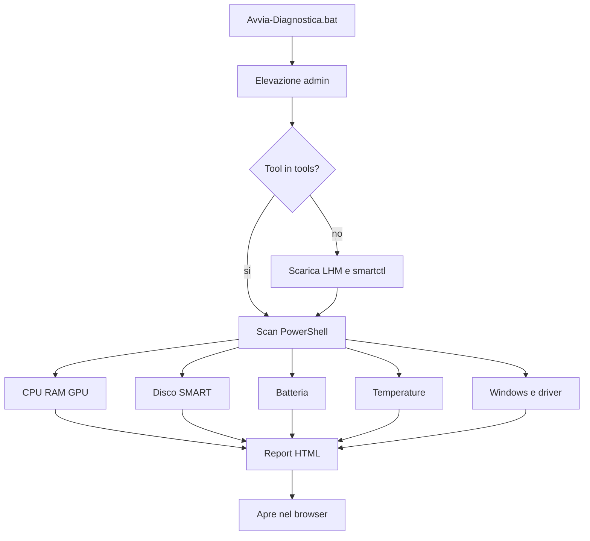

# Schema iniziale — Kit diagnostica laptop

Questo e lo schema di progetto originale, quello mostrato prima dell'implementazione.

## Obiettivo

Kit locale per Windows 11, senza installer di sistema. Si lancia con un doppio clic, produce un report HTML a colori (OK / Warning / Critical) e salva i risultati in `reports\`.

## Cosa usiamo

**Programmi nostri (PowerShell nativo Windows 11)**
- Controlli hardware e sistema tramite CIM/WMI, Event Log, `powercfg`, storage cmdlet, PnP
- Report HTML, lingua rilevata automaticamente (IT, EN, ES, FR, DE)

**Tool portatili ufficiali (scaricati in `tools\`, non nel PC)**
- [LibreHardwareMonitor](https://github.com/LibreHardwareMonitor/LibreHardwareMonitor) — temperature CPU/GPU, ventole, clock
- [smartmontools](https://www.smartmontools.org/) (`smartctl`) — SMART disco/SSD

Niente "PC repair", adware o installer globale. Tutto resta in questa cartella.

## Struttura

```
laptop-diagnostics-kit/
  Avvia-Diagnostica.bat      doppio clic: chiede admin e avvia lo scan
  Run-Diagnostics.bat        alias in inglese
  Scarica-Tool.ps1           scarica LHM + smartctl se mancano
  SCHEMA.md                  questo file
  src/
    Diagnostica-Laptop.ps1   orchestratore
    I18n.ps1                 lingue
    i18n/                    it, en, es, fr, de
    Checks-Hardware.ps1      CPU, RAM, scheda madre, GPU
    Checks-Disk.ps1          salute disco, spazio, SMART
    Checks-Battery.ps1       usura batteria, cicli, report powercfg
    Checks-Thermal.ps1       temperature e ventole (via LHM)
    Checks-Windows.ps1       DISM, eventi critici, BSOD, aggiornamenti
    Checks-Drivers.ps1       dispositivi in errore
    Report.ps1               HTML + JSON
  reports/                   HTML + JSON di ogni scan (non versionati)
  tools/                     eseguibili portatili (non versionati)
```

## Controlli del kit

| Area | Cosa verifica | Come |
|------|----------------|------|
| Panoramica | modello, CPU, RAM, OS, uptime | `Get-CimInstance` |
| Disco | HealthStatus, spazio libero, errori, SMART | `Get-PhysicalDisk`, `Get-StorageReliabilityCounter`, `smartctl` |
| Batteria | capacita originale vs attuale, cicli, usura | WMI `root\wmi` Battery*, `powercfg /batteryreport` |
| Temperature | CPU/GPU/SSD, ventole | LibreHardwareMonitor |
| RAM | modulo, velocita, errori WHEA / MemoryDiagnostics | WMI + Event Log |
| Windows | DISM CheckHealth, reboot pendente, BSOD | `Repair-WindowsImage`, Event Log |
| Driver | dispositivi Error (non quelli disabilitati) | `Get-PnpDevice` |
| Prestazioni | CPU/RAM al momento, processi top, piano alimentazione | WMI / powercfg |

Soglie di esempio: disco < 10% libero = critico; batteria usura > 30% = attenzione; temperature CPU > 90 C = critico.

## Come si usa

1. Doppio clic su `Avvia-Diagnostica.bat` o `Run-Diagnostics.bat` (serve Amministratore per SMART, batteria e DISM).
2. Lingua automatica dalla lingua di Windows, oppure: `Avvia-Diagnostica.bat en`
3. La prima volta scarica i due tool ufficiali (1-2 minuti), apre il report HTML.
4. I file restano in `reports\` per confronti nel tempo.

`sfc /scannow` **non** parte da solo: il report lo consiglia solo se DISM/eventi indicano file di sistema corrotti.

## Flusso



## Note

- Internet serve solo la prima volta, per i due download.
- Alcuni PC OEM non espongono cicli batteria o temperature ACPI: il report lo dice e usa LHM/SMART dove possibile.
- Nessun installer globale: per rimuovere il kit, elimina la cartella.
